# MoodIQ — ML Service

A FastAPI Python service that powers all machine learning and AI capabilities of MoodIQ. It hosts a custom-trained ONNX mood classification model, integrates with Spotify, YouTube Music, MusicBrainz, and the Gemini API, and exposes a comprehensive set of endpoints for mood analysis, playlist optimization, generation, lyrics processing, and user-adaptive training.

---

## System Architecture

```mermaid
graph TD
    %% Caller
    Backend["MoodIQ Backend (Node.js)"]

    %% App Entry
    App["main.py (FastAPI App)"]

    %% Endpoint Routers
    MoodR["mood_router.py"]
    OptimizeR["optimize_router.py"]
    GenerateR["generate_router.py"]
    AnalyticsR["analytics_router.py"]
    TrainR["train_router.py"]
    LiveR["live_listening_router.py"]

    %% Services
    ModelSvc["model_service.py (ONNX Inference)"]
    SpotifySvc["spotify_service.py (Spotify OAuth + API)"]
    MusicSvc["music_service.py (YTMusic + MusicBrainz)"]
    GeminiSvc["gemini_service.py (Gemini Pro API)"]
    LyricsSvc["lyrics_service.py (Genius + TextBlob)"]
    PlaylistAn["playlist_analyzer.py (Flow Analysis)"]
    NLPSvc["nlp_service.py (Intent Parsing)"]
    CacheSvc["cache_service.py (Redis)"]
    DBRecoSvc["db_recommendation_service.py (MongoDB)"]
    LiveQSvc["live_queue_service.py (Live Session Queue)"]

    %% Trained Models
    ONNX["moodiq_v4.onnx (12-class mood classifier)"]
    Meta["model_metadata.json (scaler params, class labels)"]

    %% External APIs
    Spotify["Spotify Web API"]
    YTMusic["YouTube Music API"]
    MusicBrainz["MusicBrainz / AcousticBrainz"]
    Genius["Genius API"]
    GeminiAPI["Gemini Pro API"]
    Redis["Redis Cache"]
    MongoDB["MongoDB Atlas"]

    %% Connections
    Backend --> App

    App --> MoodR
    App --> OptimizeR
    App --> GenerateR
    App --> AnalyticsR
    App --> TrainR
    App --> LiveR

    MoodR --> ModelSvc
    MoodR --> SpotifySvc
    MoodR --> CacheSvc

    OptimizeR --> ModelSvc
    OptimizeR --> SpotifySvc
    OptimizeR --> PlaylistAn
    OptimizeR --> GeminiSvc

    GenerateR --> ModelSvc
    GenerateR --> SpotifySvc
    GenerateR --> MusicSvc
    GenerateR --> GeminiSvc
    GenerateR --> NLPSvc

    AnalyticsR --> DBRecoSvc
    AnalyticsR --> SpotifySvc

    TrainR --> ModelSvc
    TrainR --> DBRecoSvc

    LiveR --> LiveQSvc
    LiveR --> ModelSvc

    LyricsSvc --> Genius
    LyricsSvc --> GeminiSvc

    ModelSvc --> ONNX
    ModelSvc --> Meta

    SpotifySvc --> Spotify
    MusicSvc --> YTMusic
    MusicSvc --> MusicBrainz
    GeminiSvc --> GeminiAPI
    CacheSvc --> Redis
    DBRecoSvc --> MongoDB
```



---

## Key Features

### 1. Mood Classification (ONNX Model)
- Custom neural network trained on Spotify audio features, exported to ONNX for fast inference.
- Classifies tracks into 12 mood categories: Anxious, Calm, Chill, Confident, Determined, Energetic, Excited, Focused, Happy, Reflective, Romantic, Sad.
- Input features: danceability, energy, loudness, speechiness, acousticness, instrumentalness, liveness, valence, tempo, spectral rate.
- Model version v4 achieves 96.07% classification accuracy.
- `model_service.py` handles ONNX runtime sessions, feature normalisation using stored scaler parameters, and batch inference.

### 2. Playlist Mood Analysis
- Fetches audio features for all tracks in a playlist via the Spotify API.
- Runs batch inference to classify every track.
- Returns per-track mood, confidence scores, and an overall playlist mood distribution.
- Results are cached in Redis keyed by playlist ID and track set hash.

### 3. Flow Optimization
- `playlist_analyzer.py` computes a mood transition graph for the current track order.
- Identifies abrupt transitions and mood gaps based on feature distance thresholds.
- AI reordering uses dynamic programming and Gemini Pro to propose an optimal track sequence that flows from a user-defined start mood to end mood.
- Gap filling searches Spotify for bridge tracks whose audio features sit between two incompatible adjacent moods.

### 4. Playlist Generation
- Generates playlists from a target mood, activity type, or natural language description.
- `nlp_service.py` parses natural language prompts into structured mood and audio feature constraints.
- Searches Spotify and YouTube Music for tracks matching the constraints.
- Optionally filters from the user's own library before fetching external tracks.
- Gemini Pro is used for context-aware playlist naming and description generation.

### 5. Lyrics Processing
- `lyrics_service.py` fetches lyrics from the Genius API using `lyricsgenius`.
- `TextBlob` performs sentiment polarity scoring on the fetched text.
- Language detection via `langdetect` with `deep-translator` for non-English lyrics.
- Falls back to Gemini Pro to reconstruct lyrics when Genius returns no results.

### 6. Live Listening Sessions
- `live_queue_service.py` maintains an in-memory queue of recently played tracks per user session.
- Provides endpoints for real-time mood updates as the user's Spotify playback changes.
- Integrates with the backend WebSocket server for low-latency push to the frontend.

### 7. User-Adaptive Training
- `train_router.py` exposes endpoints that accept user feedback records from MongoDB.
- Reweights feature importance in the recommendation scoring function based on thumbs up/down history.
- Personalised user mood profiles are stored back to MongoDB via `db_recommendation_service.py`.

### 8. Analytics
- `analytics_router.py` aggregates mood timelines, listening pattern distributions, and genre breakdown data.
- Queries MongoDB for historical listening records and returns structured chart-ready payloads.

---

## Model Details

| Property | Value |
| :--- | :--- |
| **Model format** | ONNX (Open Neural Network Exchange) |
| **Version** | v4 (`moodiq_v4.onnx`) |
| **Mood classes** | 12 (Anxious, Calm, Chill, Confident, Determined, Energetic, Excited, Focused, Happy, Reflective, Romantic, Sad) |
| **Input features** | 10 Spotify audio features (danceability, energy, loudness, speechiness, acousticness, instrumentalness, liveness, valence, tempo, spectral rate) |
| **Accuracy** | 96.07% on held-out test set |
| **Scaler** | StandardScaler parameters stored in `model_metadata.json` |
| **Training data** | Custom-labelled dataset of 200,000+ Spotify tracks (`mood_dataset_v2.csv`) |

---

## Technology Stack

| Component | Technology | Description |
| :--- | :--- | :--- |
| **Framework** | FastAPI 0.110, Uvicorn | Async Python API server |
| **ML Inference** | ONNX Runtime 1.16 | Efficient neural network inference |
| **Data Processing** | NumPy 1.24, Pandas 2.1, scikit-learn 1.3 | Feature normalisation and data handling |
| **Spotify API** | Spotipy 2.23 | Spotify OAuth and audio feature fetching |
| **YouTube Music** | ytmusicapi 1.3 | YouTube Music search for track matching |
| **Music Metadata** | musicbrainzngs 0.7 | Artist and recording metadata enrichment |
| **NLP / Lyrics** | TextBlob 0.17, lyricsgenius 3.0, langdetect 1.0 | Sentiment analysis and lyrics fetching |
| **Translation** | deep-translator 1.11 | Non-English lyrics translation |
| **AI** | google-genai (Gemini Pro) | Context-aware generation and fallback lyrics |
| **Cache** | Redis 5.0 (hiredis) | Audio feature and analysis result caching |
| **Database** | Motor (async MongoDB driver) | Async read/write of user data and history |
| **Validation** | Pydantic 2.6 | Request and response schema validation |

---

## Project Structure

```
Model/
├── endpoints/
│   ├── mood_router.py           # Mood analysis and classification endpoints
│   ├── optimize_router.py       # Flow optimization and gap filling endpoints
│   ├── generate_router.py       # Mood/activity-based playlist generation
│   ├── analytics_router.py      # Mood timeline and aggregate analytics
│   ├── train_router.py          # User-adaptive retraining endpoints
│   └── live_listening_router.py # Live session mood tracking
├── services/
│   ├── model_service.py         # ONNX model loading, inference, batch prediction
│   ├── spotify_service.py       # Spotify OAuth and audio feature fetching
│   ├── music_service.py         # YouTube Music and MusicBrainz integration
│   ├── gemini_service.py        # Gemini Pro API client
│   ├── lyrics_service.py        # Genius lyrics fetching and sentiment analysis
│   ├── playlist_analyzer.py     # Mood transition analysis and gap detection
│   ├── nlp_service.py           # Natural language intent parsing
│   ├── cache_service.py         # Redis cache helpers
│   ├── live_queue_service.py    # In-memory live session management
│   └── db_recommendation_service.py  # MongoDB queries for recommendations
├── models/
│   ├── moodiq_v4.onnx           # Production ONNX model weights
│   ├── mood_model.onnx          # Earlier model version
│   └── model_metadata.json      # Scaler parameters and class label mapping
├── main.py                      # FastAPI app entry point, router registration, startup
├── train_mood_model.py          # Training script (original model)
├── train_mood_model_12mood.py   # Training script (12-class model)
├── prepare_moodiq_dataset.py    # Dataset preparation and feature labelling
├── label_12mood_dataset.py      # 12-class labelling pipeline
├── populate_database.py         # Seeds MongoDB with initial track/mood data
├── test_onnx_model.py           # ONNX inference verification tests
├── test_complete_flow.py        # End-to-end endpoint flow tests
├── requirements.txt             # Production Python dependencies
└── .python-version              # Python version pin (3.11)
```

---

## Getting Started

### Prerequisites

- Python 3.11
- Redis instance (optional but recommended for caching)
- MongoDB Atlas cluster
- Spotify Developer application credentials
- Gemini API key
- Genius API access token

### Step 1: Environment Setup

```bash
cp .env .env.local
```

Fill in the following variables:

| Variable | Description |
| :--- | :--- |
| `SPOTIFY_CLIENT_ID` | Spotify application client ID |
| `SPOTIFY_CLIENT_SECRET` | Spotify application client secret |
| `SPOTIFY_REDIRECT_URI` | OAuth redirect URI registered in Spotify |
| `GEMINI_API_KEY` | Google Gemini Pro API key |
| `GENIUS_ACCESS_TOKEN` | Genius API token |
| `REDIS_URL` | Redis connection URL |
| `MONGODB_URI` | MongoDB Atlas connection string |
| `ALLOWED_ORIGINS` | Comma-separated list of allowed frontend origins |

### Step 2: Create Virtual Environment

```bash
python3 -m venv venv
source venv/bin/activate
```

### Step 3: Install Dependencies

```bash
pip install -r requirements.txt
```

### Step 4: Run the Service

```bash
uvicorn main:app --reload --port 8000
```

The service starts on `http://localhost:8000`.

Interactive API documentation is available at:
- Swagger UI: `http://localhost:8000/docs`
- ReDoc: `http://localhost:8000/redoc`

---

## API Endpoints (Summary)

| Route | Description |
| :--- | :--- |
| `GET /health` | Service health and model status |
| `POST /mood/analyze` | Classify mood for a list of tracks |
| `POST /mood/playlist` | Full playlist mood analysis |
| `POST /optimize/reorder` | AI-powered playlist reordering for smooth mood flow |
| `POST /optimize/fill-gaps` | Find bridge tracks to fill mood gaps |
| `POST /generate/playlist` | Generate a playlist from a target mood or activity |
| `POST /generate/nlp` | Generate a playlist from a natural language prompt |
| `GET /analytics/timeline` | Mood timeline aggregated from listening history |
| `POST /train/feedback` | Submit user feedback to adapt recommendations |
| `POST /live/update` | Push current track for live session mood update |

---

## License

This project is licensed under the [MIT License](LICENSE).
